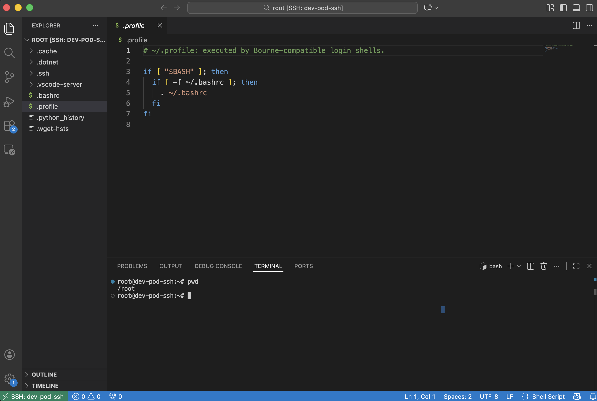
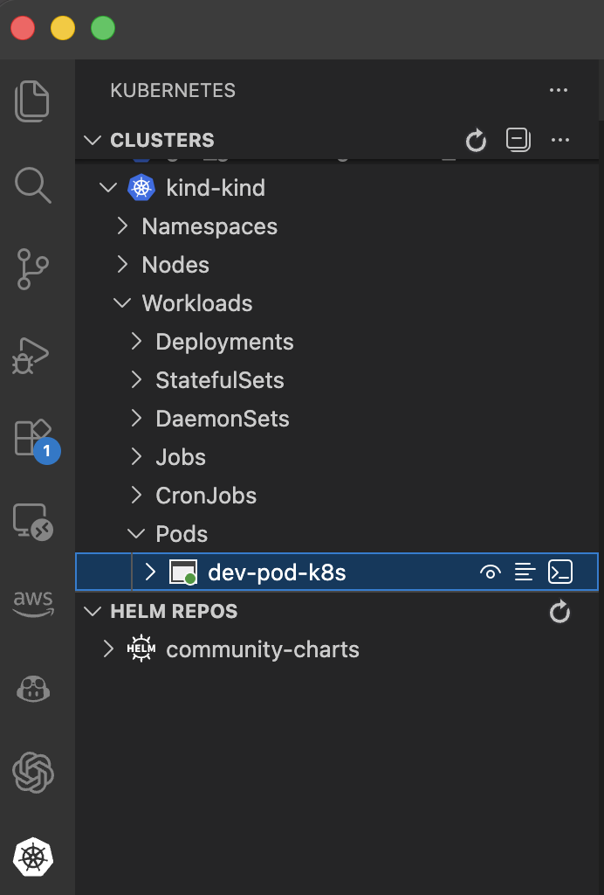

# VSCode リモート接続 基本編

Kubernetes上のPodにVSCodeからリモート接続して、
コーディングやデバッグをする方法を調査しました。

まずはシンプルにK8s上に開発用のPodを起動して、下記の2つの方法で接続する方法を試しました。

- VSCode Remote - SSH 拡張機能で接続する
- VSCode Kubernetes + DevContainer 拡張で接続する

KubernetesとDevContainerの拡張を使う方が、
少ない手間でPodに接続することができます。

## VSCode Remote - SSH 拡張機能で接続する

Pod上でSSHサーバーを起動し、VSCodeから接続します。
VSCodeとPod間の通信経路はkubectl port-forwardを使って作成します。

下記にサンプルのPodのマニフェストを示します。

ポイントはPodにsshサーバーをインストールして、
接続用のrootパスワードを設定しているところです。

```yaml
apiVersion: v1
kind: Pod
metadata:
  name: dev-pod-ssh
  labels:
    app: dev-pod-ssh
spec:
  containers:
  - name: dev
    image: python:3.11-slim
    command: ["/bin/bash"]
    args: 
    - "-c"
    - |
      apt-get update && \
      apt-get install -y openssh-server sudo vim git && \
      mkdir -p /var/run/sshd && \
      echo 'root:devpass' | chpasswd && \
      sed -i 's/#PermitRootLogin prohibit-password/PermitRootLogin yes/' /etc/ssh/sshd_config && \
      /usr/sbin/sshd -D
    ports:
    - containerPort: 22
      name: ssh
    volumeMounts:
    - name: workspace
      mountPath: /workspace
  volumes:
  - name: workspace
    emptyDir: {}
```

このマニフェストをデプロイします。

```bash
kubectl apply -f ./dev-pod-ssh.yaml
```

```bash
% kubectl get pods
NAME                                READY   STATUS    RESTARTS       AGE
dev-pod-ssh                         1/1     Running   0              3s
```

kubectl port-forwardでPodのsshポートへのポートフォワードを有効にします。

```bash
% kubectl port-forward pod/dev-pod-ssh 2222:22
Forwarding from 127.0.0.1:2222 -> 22
Forwarding from [::1]:2222 -> 22
```

~/.ssh/configに接続設定を記入しておきます。

```config
Host dev-pod-ssh
  HostName localhost
  Port 2222
  User root
  StrictHostKeyChecking no
  UserKnownHostsFile /dev/null
```

まず、sshコマンドで接続できることを確認します。

```bash
% ssh dev-pod-ssh
Warning: Permanently added '[localhost]:2222' (ED25519) to the list of known hosts.
root@localhost's password: 
Linux dev-pod-ssh 6.12.54-linuxkit #1 SMP Tue Nov  4 21:21:47 UTC 2025 aarch64

The programs included with the Debian GNU/Linux system are free software;
the exact distribution terms for each program are described in the
individual files in /usr/share/doc/*/copyright.

Debian GNU/Linux comes with ABSOLUTELY NO WARRANTY, to the extent
permitted by applicable law.
```

次にVSCodeからRemote - SSH拡張機能で接続してみます。

事前にVSCodeにRemote - SSH拡張機能をインストールしておきます。

Command Paletteを開いて、`Remote-SSH: Connect to host...`を選択します。

接続先の選択肢が表示されるので、`~/.ssh/config`に設定した
`dev-pod-ssh`を選択します。

新しいVSCodeのウィンドウが起動します。
SSH接続のパスワードを求められるので、マニフェストで設定した値`devpass`を入力します。

下記のようにVSCodeからPod環境にアクセスができます。



## VSCode Kubernetes + DevContainer 拡張で接続する

Pod上でVSCodeサーバーを起動し、VSCodeから接続します。
VSCodeサーバーのPodへのインストールは、拡張機能が自動で行います。

VSCode上でK8sのPod一覧が表示されます。
一覧からPodを選択することでVSCodeから接続することができます。


下記にサンプルのPodのマニフェストを示します。

Podが終了しないようにsleepさせる以外は、
特別な処理は行なっていません。

```yaml
apiVersion: v1
kind: Pod
metadata:
  name: dev-pod-k8s
  labels:
    app: ai-dev
spec:
  containers:
  - name: dev
    image: python:3.11
    command: ["sleep", "infinity"]
    workingDir: /workspace
    volumeMounts:
    - name: workspace
      mountPath: /workspace
  volumes:
  - name: workspace
    emptyDir: {}
```

このマニフェストをK8sにデプロイします。

```bash
% kubectl apply -f ./dev-pod-k8s.yaml
pod/dev-pod-k8s created
dev-pod % kubectl get pods
NAME                                READY   STATUS    RESTARTS       AGE
dev-pod-k8s                          1/1     Running   0              5s
```

事前にVSCodeのKubernetesとDevContainerの拡張機能をインストールしておきます。

VSCodeのKubernetesのメニューから起動中のPodを確認できます。



コンテキストメニューから`Attach Visual Studio Code`を選択することで、
対象のPodにVSCodeからアクセスすることができます。


Remote - SSH方式と比較して、kubectl port-forwardコマンドの実行や、SSHパスワードの入力などが不要で使い勝手がよいです。

## まとめと課題

K8s上のPodへのVSCodeによる接続は、
対象のPodが動いているK8sクラスタに対してkubectlが実行できる環境を
用意できれば、実現できます。

マルチクラスタ環境の場合、どのクラスタでPodが動いているのかを
何らかの方法で確認できるようにする必要があります。

環境の永続化対応は別途必要です。
ホームディレクトリを外部のファイルシステムにおいて、
PVCでマウントして利用するといった対応が考えられます。
アクセス制御が課題になりそうです。

Podへのアクセス制御についても要求によっては必要です。
基本的にK8sの名前空間とRBACの組み合わせでの制御になります。
個人単位で制御しようとした場合、個人ごとに名前空間が必要になるため
運用が煩雑になる可能性があります。


