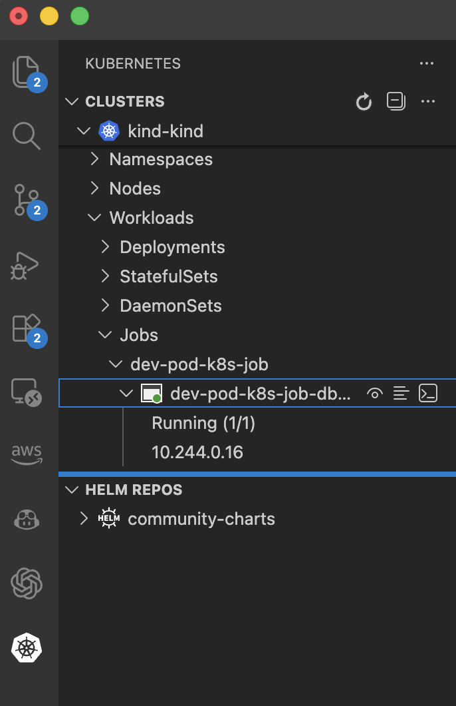

# VSCode リモート接続 応用編　ジョブ

Kubernetes上のPodにVSCodeからリモート接続して、
コーディングやデバッグをする方法の応用編として、
ジョブとしてデプロイしたPodにアクセスできるか確認します。

シングルクラスタ構成とMultiKueueを使った
マルチクラスタ構成の両方で確認します。

調査環境としてkindを利用しています。

## シングルクラスタでのジョブ投入からのVSCode接続

kindクラスタにkueueをインストールします。

```bash
kubectl apply --server-side -f https://github.com/kubernetes-sigs/kueue/releases/download/v0.16.0/manifests.yaml
```

ジョブとして開発用Podをデプロイします。

```yaml
apiVersion: batch/v1
kind: Job
metadata:
  name: dev-pod-k8s-job
spec:
  backoffLimit: 0
  template:
    metadata:
      labels:
        app: dev-pod-job
    spec:
      restartPolicy: Never
      containers:
      - name: dev
        image: python:3.11
        command: ["sleep", "infinity"]
        workingDir: /workspace
        volumeMounts:
        - name: workspace
          mountPath: /workspace
      volumes:
      - name: workspace
        emptyDir: {}
```

```bash
% kubectl create -f ./dev-pod-k8s-job.yaml 
job.batch/dev-pod-k8s-job created
shizuku@bleu VSCode % kubectl get pods
NAME                                READY   STATUS    RESTARTS      AGE
dev-pod-k8s-job-dbwpr               1/1     Running   0             5s
```

VSCodeのK8s拡張機能からJobとそれに紐づくPodを確認し、
Podを選択して`Attach Visual Studio Code`を実行します。

VSCodeからPodにアクセスができます。



## マルチクラスタでのジョブ投入からのVSCode接続

マルチクラスタの場合、Podがどこにデプロイされたのかを
確認するための一手間が必要です。

VSCodeを実行している環境のkubectlのコンテキストもそのクラスタを向くように設定をする必要があります。

pinnipedを使っているので認証は1回で良いです。
コンテキスト切り替えの部分をサポートするツールがあると良いと思います。

TBD(MultiKueue環境での検証結果)


