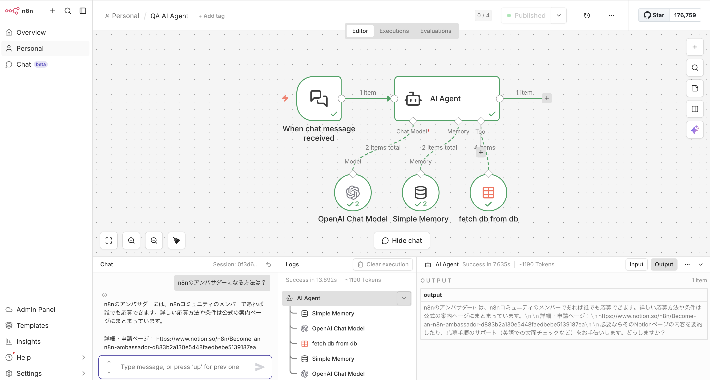
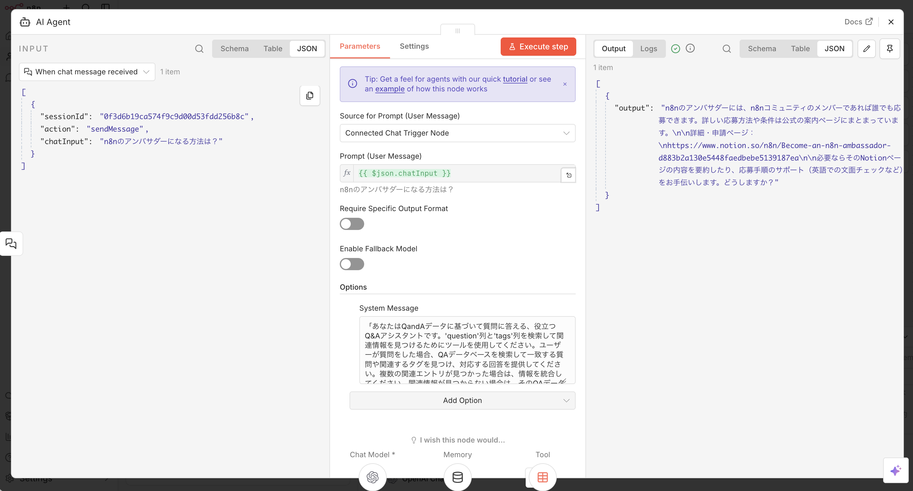
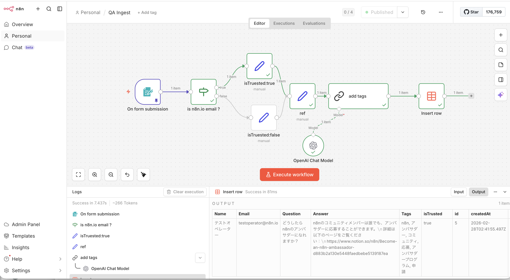
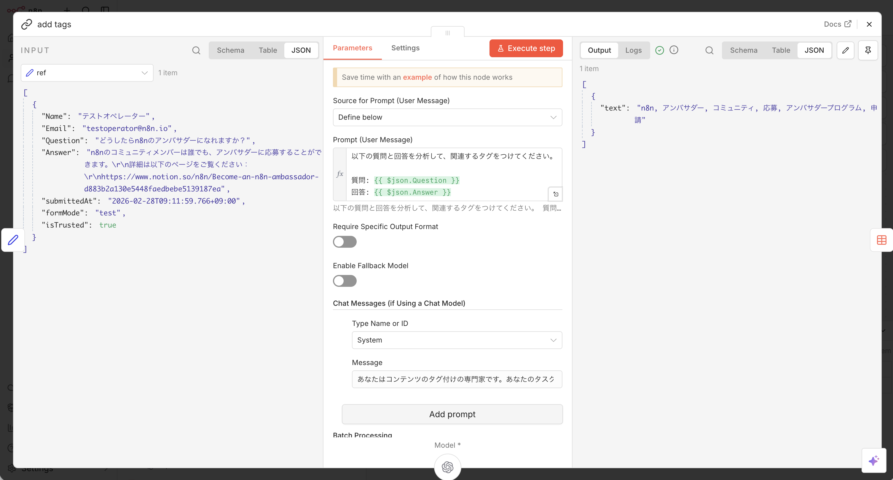

# n8nを試してみる

## 概要

下記のn8n公式サイトの動画チュートリアルに従って、n8nを使ってみました。

- [n8n公式チュートリアル動画](https://youtu.be/GuaKeDS6UKU)

n8nが提供しているSaaS型のサービスを利用する方法と、セルフホストする方法があります。

今回は、n8nの概要を掴むのが目的のため、SaaS型サービスを利用しました。

## 初期設定

n8nのSaaS版は、アカウントを作成することで期間限定で無償で利用することができます。

**無料で利用できる機能：**

- n8nのワークフロー作成・実行機能
- OpenAI API: 100回分の無料クレジット（ワークフロー内でLLMの呼び出しを行う際に使用）

この無料枠により、実際にLLMを組み込んだワークフローを試すことができます。

## チュートリアルの内容

チュートリアルでは下記の二つのワークフローを作ります。

- n8nに関する質問に回答するチャットボットのワークフロー
- 上記のチャットボットが参照するデータベースへのデータ入力を支援するワークフロー

どちらも内部でLLM (OpenAI API) を利用します。

## ワークフローの構築

n8nが提供するGUI上で、ワークフローを組んでいきます。データパイプラインをイメージすると組みやすかったです。

### トリガーの定義

最初にワークフローを開始するトリガーとなるイベントを定義します。

- チャットボットの場合: チャット入力
- データ入力の場合: データ入力用のフォーム

### データフロー

入力データがワークフローの中に入り、その後は、ワークフロー内の各要素でそのデータを変換したり、追加したり、新たなデータを生成したりします。

最終的には、それらのデータを、チャットボットの応答として出力したり、データベースに格納したりします。

### ワークフローの構成例

#### 1. チャットボットのワークフロー

このワークフローでは、n8nに関する質問に対してRAG（Retrieval-Augmented Generation）方式で回答するチャットボットを構築します。

**ワークフローの構成：**

- チャット入力によるトリガー
- RAGタイプのAIエージェントによる処理
  - LLM (OpenAI Chat Model)
  - 会話メモリ (Simple Memory)
  - 外部データソース (fetch.ai等のツール)

**AI Agentノードの設定：**

#### 2. データ入力支援のワークフロー

このワークフローでは、上記のチャットボットが参照するデータベースへのデータ入力を支援します。フォーム入力されたデータをパイプラインで処理し、ルールベースの処理とLLMによる処理を組み合わせて、構造化されたデータをデータベースに格納します。

**ワークフローの構成：**

- Webフォームによる入力
- フォームの入力内容による分類と結果の追加（ルールによる決定的な処理）
- フォームの入力内容によるタグの追加（LLMによる確率的な処理）
- データベースへの登録

**LLMノードの設定：**

個別のLLMノード（例：タグ付けノード）では、より具体的なタスクに特化したプロンプトを設定します。上記の例では、コンテンツにタグを付けるAIとして動作するよう指示が記述されています。

### ワークフローの設計思想

内部でLLMによる知的な処理ができるデータパイプラインと考えると理解しやすいです。決定的なルールベースの処理と、確率的なLLMベースの処理を組み合わせることで、柔軟で拡張性の高いワークフローを構築できます。

## ワークフローの公開

### 公開方法

作成したワークフローは、Publishすることで、インターネットに公開できます。公開用のURLが自動的に発行され、そこにアクセスすると以下のように表示されます。

- **チャットボットの場合**: 簡易的なチャットインタフェースが表示されます
- **Webフォームの場合**: 設計したフォームがそのまま表示されます

### 認証設定

デフォルトでは認証がかかっていないため、URLを知っている人は誰でもアクセスできる状態になります。

**BASIC認証**

ワークフロー上の設定で、BASIC認証を設定することができます。

**SSO連携などのより高度な認証**

より高度な認証方法として、SSO連携（SAMLやOIDC）が考えられますが、
この機能はn8nでは提供されません。
SSO連携ができるWebアプリケーションを開発し、その内部でn8nのワークフローを利用する、というような構成にする必要があります。

n8nのEnterprise PlanではSS0連携機能が提供されますが、
これはn8n自体にログインするときの連携であり、
n8nで作ったここのワークフローを実行するときのログイン認証とは異なります。

## まとめ

n8nは、ノーコード/ローコードでワークフローを構築できる強力なツールです。特に以下の点が印象的でした：

- **直感的なGUI**: データパイプラインの考え方で視覚的にワークフローを設計できる
- **LLMとの統合**: OpenAI APIなどのLLMを簡単にワークフローに組み込める
- **柔軟な処理の組み合わせ**: ルールベースの処理とLLMベースの処理を組み合わせられる
- **簡単な公開**: 作成したワークフローをすぐにWebサービスとして公開できる

